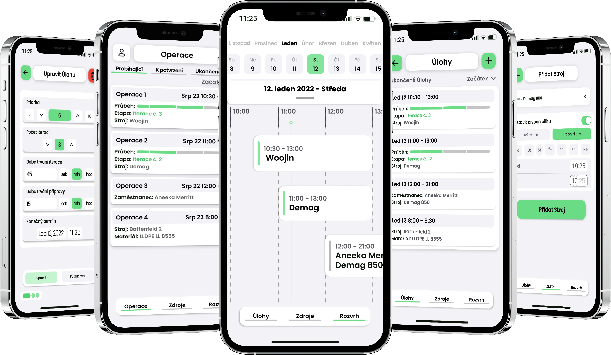

# Contents of this Repository

## DemoApps

Simple applications in form of todo lists demonstrating the use of the CoreData vs Document based storage. 

## PlannerLoop

iOS Client Interface for Production Scheduling System

Mobile application for iOS operating system, which served as an interface for PlannerLoop service, which is a production scheduling system. The application ensures the acquisition of the necessary user data, which it processes and sends to the computing server provided by the service. The user entered operations are scheduled by the service and placed by the client application on a timeline in the schedule, where it is possible to manipulate the operations.

.
